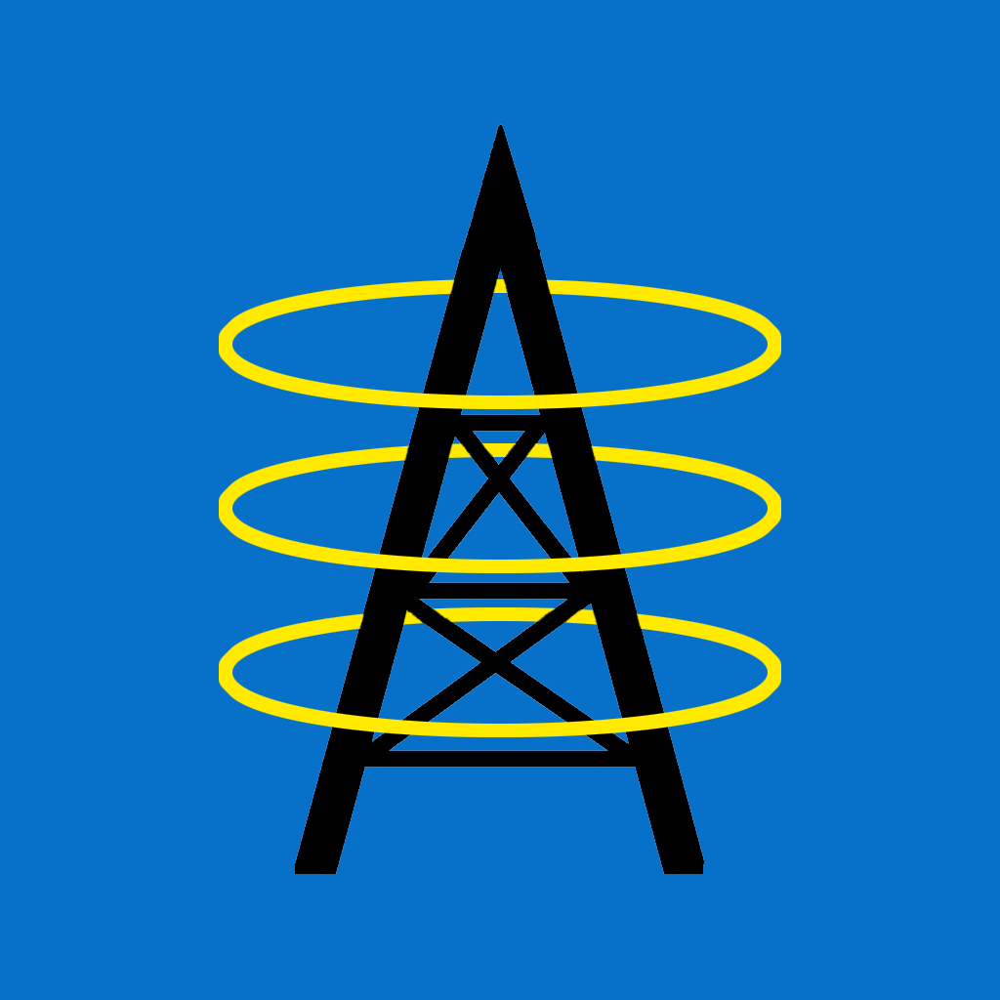

  
  <h1 align="center">Radio Stations Near Me</h1>

This app uses your device's location to find nearby AM and FM station frequencies. This can be especially useful on road trips or when visiting a new city. Radio hobbyists who want to know the wattage and location of transmitters can align their antennas accordingly.

Station format (e.g. Sports, Classical Rock) is available for most station frequencies. Users can update incorrect information, which is immediately reflected in the database and available to all users.

The schema is originally imported using government FCC records. Third party sources are then used to populate the station format.

## Technology Stack

### Frontend

This application was written using [React Native](https://reactnative.dev/) with [TypeScript](https://www.typescriptlang.org/). [React Navigation](https://reactnavigation.org/) is used as the foundation. It builds on both Android and IOS platforms. It is deployed to the app stores using the [expo](https://expo.dev) open source platform. Many thanks to the expo team!

### Backend

The backend consists of [MySQL](https://hub.docker.com/_/mysql) and [NodeJS](https://hub.docker.com/_/node/) docker containers and is easily deployed via `docker compose` to a docker supported OS. Please see [docker-compose.yml](./nodejs/docker-compose.yml) for more information. 

Queries are extremely fast using the `ST_Distance_Sphere` MySQL function. 

## Demo

### Author

[Allen Walker](mailto:allen_walker3@pm.me?subject=[GitHub])
([@github](https://github.com/allenwalker3))  ([@linkedin](https://www.linkedin.com/in/allenwalker3/)) 

Feel free to contact me with questions. I'm also open to senior developer opportunities.

## 🔗 Links

- [FCC](https://www.fcc.gov/media/radio/broadcast-radio-links)
- [How To Publish Expo React Native Application To The Apple App Store](https://www.notjust.dev/blog/2022-03-29-how-to-publish-expo-react-native-app-to-apple-app-store)
- [Expo Google Fonts](https://github.com/expo/google-fonts)